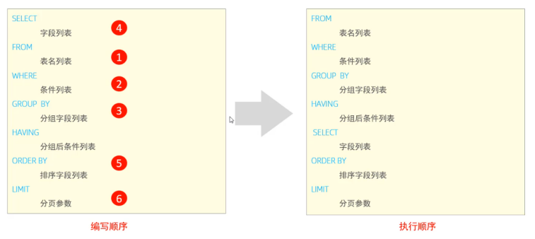
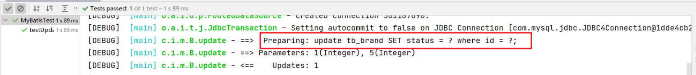
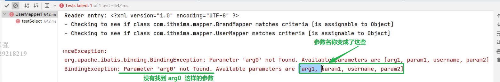
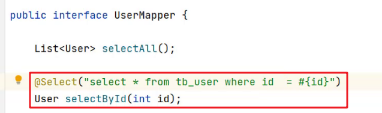

# MySQL

## 1.SQL

### 1.1SQL通用语法

**注释：**

```mysql
单行注释：--注释内容	或	#注释内容
多行注释：/*注释内容*/
```

### 1.2 DDL

#### 1.2.1 数据库操作

##### 1.查询所有的数据库

```mysql
show databases ;
```

##### 2.查询当前数据库

```mysql
select database() ;
```

##### 3.创建数据库

```mysql
create database [ if not exists ] 数据库名 [ default charset 字符集 ] [ collate 排序
规则 ] ;
```

##### 4.删除数据库

```mysql
drop database [ if exists ] 数据库名 ;
```

##### 5.切换数据库

```mysql
use 数据库名 ;
```

#### 1.2.2 表操作

##### 1.查询当前数据库所有表

```mysql
 show tables;
```

##### 2.查看指定表结构

```mysql
desc 表名 ;
```

##### 3.查询指定表的建表语句

```mysql
show create table 表名 ;
```

##### 4.创建表结构

```mysql
CREATE TABLE 表名(
字段1 字段1类型 [ COMMENT 字段1注释 ],
字段2 字段2类型 [COMMENT 字段2注释 ],
字段3 字段3类型 [COMMENT 字段3注释 ],
......
字段n 字段n类型 [COMMENT 字段n注释 ]
) [ COMMENT 表注释 ] ;
```

#### 1.2.3表操作-数据类型

|   **数据类型**   |   **大小**    |       **描述**       |                              |
| :--------------: | :-----------: | :------------------: | ---------------------------- |
|   **tinyint**    |   **1byte**   |    **极小整数值**    |                              |
| **int或integer** |   **4byte**   |      **整数值**      | **默认长度11**               |
|    **float**     |   **4byte**   |    **单精度小数**    | **float(总长度，小数位数)**  |
|    **double**    |   **8byte**   |    **双精度小数**    | **double(总长度，小数位数)** |
|     **date**     |     **3**     |      **日期值**      |                              |
|   **datetime**   |     **8**     | **混合日期和时间值** | **默认值null**               |
|     **char**     | **0~255byte** |    **定长字符串**    |                              |
|     varchar      |  0~65535byte  |      变长字符串      |                              |

#### 1.2.4表操作-修改

##### 1.添加字段

```mysql
ALTER TABLE 表名 ADD 字段名 类型 (长度) [ COMMENT 注释 ] [ 约束 ];
```

##### 2.修改数据类型

```mysql
ALTER TABLE 表名 MODIFY 字段名 新数据类型 (长度);

```

##### 3.修改字段名和字段类型

```mysql
ALTER TABLE 表名 CHANGE 旧字段名 新字段名 类型 (长度) [ COMMENT 注释 ] [ 约束 ];
```

##### 4.删除字段

```mysql
ALTER TABLE 表名 DROP 字段名;
```

5.修改表名

```mysql
ALTER TABLE 表名 RENAME TO 新表名;
```

#### 1.2.5表操作-删除

##### 1.删除表

```mysql
DROP TABLE [ IF EXISTS ] 表名;
```

##### 2.删除指定表，并重新创建表

```mysql
TRUNCATE TABLE 表名;
```

### 1.3DML

#### 1.3.1添加数据

##### 1.给指定字段添加数据

```mysql
INSERT INTO 表名 (字段名1, 字段名2, ...) VALUES (值1, 值2, ...);
```

##### 2.给全部字段添加数据

```mysql
INSERT INTO 表名 VALUES (值1, 值2, ...);
```

##### 3.批量添加数据

```mysql
INSERT INTO 表名 (字段名1, 字段名2, ...) VALUES (值1, 值2, ...), (值1, 值2, ...), (值
1, 值2, ...) ;
```

```mysql
INSERT INTO 表名 VALUES (值1, 值2, ...), (值1, 值2, ...), (值1, 值2, ...) ;
```

#### 1.3.2修改数据

```mysql
UPDATE 表名 SET 字段名1 = 值1 , 字段名2 = 值2 , .... [ WHERE 条件 ] ;
```

#### 1.3.3删除数据

```mysql
DELETE FROM 表名 [ WHERE 条件 ] ;
```

### 1.4DQL

#### 1.4.1基础语法

```mysql
SELECT
字段列表
FROM
表名列表
WHERE
条件列表
GROUP BY
分组字段列表
HAVING
分组后条件列表
ORDER BY
排序字段列表
LIMIT
分页参数
```

- 基础查询（不带任何条件）
- 条件查询（where）
- 聚合查询（count、max、min、avg、sum）
- 分组查询（group by）
- 排序查询（order by）
- 分页查询（limit）

#### 1.4.2基础查询

##### 1.查询多个字段

```mysql
SELECT 字段1, 字段2, 字段3 ... FROM 表名 ;
```

```mysql
SELECT * FROM 表名 ;
```

注意 : * 号代表查询所有字段

##### 2.字段设置别名

```mysql
SELECT 字段1 [ AS 别名1 ] , 字段2 [ AS 别名2 ] ... FROM 表名;
```

```mysql
SELECT 字段1 [ 别名1 ] , 字段2 [ 别名2 ] ... FROM 表名;
```

##### 3.去除重复记录

```mysql
SELECT DISTINCT 字段列表 FROM 表名;
```

#### 1.4.3条件查询

##### 1.语法

```mysql
SELECT 字段列表 FROM 表名 WHERE 条件列表 ;
```

##### 2.条件

常用的比较运算符如下：


常用的逻辑运算符如下：


#### 1.4.4聚合查询

介绍：将一列数据作为一个整体，进行纵向计算

##### 1.常见的聚合函数


##### 2.语法

```mysql
SELECT 聚合函数(字段列表) FROM 表名 ;
```

注意 : NULL值是不参与所有聚合函数运算的。

#### 1.4.5分组查询

##### 1.语法

```mysql
SELECT 字段列表 FROM 表名 [ WHERE 条件 ] GROUP BY 分组字段名 [ HAVING 分组
后过滤条件 ];
```

##### 2.where与having区别

- 执行时机不同：where是分组之前进行过滤，不满足where条件，不参与分组；而having是分组 之后对结果进行过滤。
- 判断条件不同：where不能对聚合函数进行判断，而having可以。

**注意事项：**

- 分组之后，查询的字段一般为聚合函数和分组字段，查询其他字段无任何意义。
- 执行顺序: where > 聚合函数 > having 。
- 支持多字段分组, 具体语法为 : group by columnA,columnB

#### 1.4.6排序查询

排序在日常开发中是非常常见的一个操作，有升序排序，也有降序排序。

##### 1.语法

```mysql
SELECT 字段列表 FROM 表名 ORDER BY 字段1 排序方式1 , 字段2 排序方式2 ;
```

##### 2.排序方式

- ASC : 升序(默认值)
- DESC: 降序

注意事项：

- 如果是升序, 可以不指定排序方式ASC ;
- 如果是多字段排序，当第一个字段值相同时，才会根据第二个字段进行排序 ;

#### 1.4.7分页查询

##### 1.语法

```mysql
SELECT 字段列表 FROM 表名 LIMIT 起始索引, 查询记录数 ;
```

注意事项：

-  起始索引从0开始，起始索引 = （查询页码 - 1）* 每页显示记录数。
- 分页查询是数据库的方言，不同的数据库有不同的实现，MySQL中是LIMIT。
- 如果查询的是第一页数据，起始索引可以省略，直接简写为 limit 10。

#### 1.4.8案例

1. 查询年龄为20,21,22,23岁的员工信息。

   ```mysql
   select * from emp where gender = '女' and age in(20,21,22,23);
   ```

2.  查询性别为 男 ，并且年龄在 20-40 岁(含)以内的姓名为三个字的员工。

   ```mysql
   select * from emp where gender = '男' and ( age between 20 and 40 ) and name like
   '___';
   ```

3. 统计员工表中, 年龄小于60岁的 , 男性员工和女性员工的人数。

   ```mysql
   select gender, count(*) from emp where age < 60 group by gender;
   ```

4. 查询所有年龄小于等于35岁员工的姓名和年龄，并对查询结果按年龄升序排序，如果年龄相同按 入职时间降序排序。

   ```mysql
   select name , age from emp where age <= 35 order by age asc , entrydate desc;
   ```

5. 查询性别为男，且年龄在20-40 岁(含)以内的前5个员工信息，对查询的结果按年龄升序排序， 年龄相同按入职时间升序排序。

   ```mysql
   select * from emp where gender = '男' and age between 20 and 40 order by age asc ,
   entrydate asc limit 5 ;
   ```

#### 1.4.9执行顺序



**验证：**

1. 查询年龄大于15的员工姓名、年龄，并根据年龄进行升序排序。

   ```mysql
   select name , age from emp where age > 15 order by age asc;
   ```

2. 在查询时，我们给emp表起一个别名 e，然后在select 及 where中使用该别名。

   ```mysql
   select e.name , e.age from emp e where e.age > 15 order by age asc;
   ```

   ```mysql
   select e.name ename , e.age eage from emp e where e.age > 15 order by eage asc;
   ```

DQL语句的执行顺序为： **from ... where ... group by ... having ... select ... order by ... limit ...**

## 2.约束

### 2.1概述

概念：约束是作用于表中字段上的规则，用于限制存储在表中的数据。

目的：保证数据库中数据的正确、有效性和完整性。


**注意：**约束是作用于表中字段上的，可以在创建表/修改表的时候添加约束。

### 2.2约束演示


### 2.3外键约束

#### 2.3.1介绍

外键：用来让两张表的数据之间建立连接，从而保证数据的一致性和完整性。


**注意：**目前上述两张表，只是在逻辑上存在这样一层关系；在数据库层面，并未建立外键关联， 所以是无法保证数据的一致性和完整性的。

#### 2.3.2语法

##### 1.添加外键

```mysql
CREATE TABLE 表名(
字段名 数据类型,
...
[CONSTRAINT] [外键名称] FOREIGN KEY (外键字段名) REFERENCES 主表 (主表列名)
);
```

```mysql
ALTER TABLE 表名 ADD CONSTRAINT 外键名称 FOREIGN KEY (外键字段名)
REFERENCES 主表 (主表列名) ;
```

##### 2.删除外键

```mysql
ALTER TABLE 表名 DROP FOREIGN KEY 外键名称;
```

#### 2.3.3删除/更新行为

添加了外键之后，再删除父表数据时产生的约束行为，我们就称为删除/更新行为。具体的删除/更新行 为有以下几种:

# JDBC&Maven

## 1.JDBC

### 1.1JDBC编写步骤

- 创建工程，导入驱动jar包

- 注册驱动

  ```mysql
  Class.forName("com.mysql.jdbc.Driver");
  ```

- 获取连接

  ```mysql
  Connection conn = DriverManager.getConnection(url, username, password);
  ```

  Java代码需要发送SQL给MySQL服务端，就需要先建立连接

- 定义SQL语句

  ```mysql
  String sql =  "update…" ;
  ```

- 获取执行SQL对象

  执行SQL语句需要SQL执行对象，而这个执行对象就是 PreparedStatement对象

  ```mysql
  PreparedStatement ps = conn.prepareStatement(sql);
  ```

- 执行SQL

  ```mysql
  ps.executeUpdate(sql);  
  ```

- 处理返回结果

- 释放资源

### 1.2具体操作

1. 创建新的空的项目

2. 定义项目的名称，并指定位置

3. 对项目进行设置，JDK版本、编译版本

4. 创建模块，指定模块的名称及位置

5. 导入驱动包

   将mysql的驱动包放在模块下的lib目录（随意命名）下，并将该jar包添加为库文件

   - 在添加为库文件的时候，有如下三个选项
     * Global Library  ： 全局有效
     * Project Library :   项目有效
     * Module Library ： 模块有效

6. 在src下创建类

   ```java
   /**
    * JDBC快速入门
    */
   public class JDBCDemo {
          public static void main(String[] args) throws Exception {
           //1 注册驱动，告诉程序使用哪个数据库
           Class.forName("com.mysql.jdbc.Driver");
           //2 获取连接对象 Connection
           String url="jdbc:mysql://localhost:3306/db2";   //连接路径，表示连接哪个数据库
           String username="root";
           String password="root";
           Connection conn = DriverManager.getConnection(url,username,password);
           //3 获取执行SQL的执行者对象  PreparedStatement
           PreparedStatement ps = conn.prepareStatement("update account set money = 3000 where id=1");
           //4 执行操作
           int count = ps.executeUpdate();
           //5 处理结果
           System.out.println("影响的行数： " + count);
           //6 释放资源
           ps.close();
           conn.close();
       }
   }
   ```

## 2.JDBC API详解

### 2.1DriverManager

DriverManager（驱动管理类）作用：

* 注册驱动

  

  registerDriver方法是用于注册驱动的，但是我们之前做的入门案例并不是这样写的。而是如下实现

  ```sql
  Class.forName("com.mysql.jdbc.Driver");
  ```

  我们查询MySQL提供的Driver类，看它是如何实现的，源码如下：

  

  在该类中的静态代码块中已经执行了 `DriverManager` 对象的 `registerDriver()` 方法进行驱动的注册了，那么我们只需要加载 `Driver` 类，该静态代码块就会执行。而 `Class.forName("com.mysql.jdbc.Driver");` 就可以加载 `Driver` 类。

  > ==提示：==
  >
  > * MySQL 5之后的驱动包，可以省略注册驱动的步骤
  > * 自动加载jar包中META-INF/services/java.sql.Driver文件中的驱动类

* 获取数据库连接

  

  参数说明：

  * url ： 连接路径

    > 语法：jdbc:mysql://ip地址(域名):端口号/数据库名称?参数键值对1&参数键值对2…
    >
    > 示例：jdbc:mysql://127.0.0.1:3306/db1
    >
    > ==细节：==
    >
    > * 如果连接的是本机mysql服务器，并且mysql服务默认端口是3306，则url可以简写为：jdbc:mysql:///数据库名称?参数键值对
    >
    > * 配置 useSSL=false 参数，禁用安全连接方式，解决警告提示

  * user ：用户名

  * poassword ：密码


 


# MyBatis

## 1.MyBatis入门

JavaEE三层架构：表现层、业务层、持久层

ORM（Object Relationl Mapping），对象关系映射，即在数据库 和对象之间作映射处理。

MyBatis是一个半自动的持久层框架，其本质是对JDBC的封装。

**需求：查询user表中所有的数据**

1. 创建user表，添加数据

   ```mysql
   create database mybatis;
   use mybatis;
   
   drop table if exists tb_user;
   
   create table tb_user(
   	id int primary key auto_increment,
   	username varchar(20),
   	password varchar(20),
   	gender char(1),
   	addr varchar(30)
   );
   
   INSERT INTO tb_user VALUES (1, 'zhangsan', '123', '男', '北京');
   INSERT INTO tb_user VALUES (2, '李四', '234', '女', '天津');
   INSERT INTO tb_user VALUES (3, '王五', '11', '男', '西安');
   ```

2. 创建maven模块，导入坐标
   在创建好的模块中的 pom.xml 配置文件中添加依赖的坐标

   ```xml
   <dependencies>
       <!--mybatis 依赖-->
       <dependency>
           <groupId>org.mybatis</groupId>
           <artifactId>mybatis</artifactId>
           <version>3.5.5</version>
       </dependency>
   
       <!--mysql 驱动-->
       <dependency>
           <groupId>mysql</groupId>
           <artifactId>mysql-connector-java</artifactId>
           <version>5.1.46</version>
       </dependency>
   
       <!--junit 单元测试-->
       <dependency>
           <groupId>junit</groupId>
           <artifactId>junit</artifactId>
           <version>4.13</version>
           <scope>test</scope>
       </dependency>
   
       <!-- 添加slf4j日志api -->
       <dependency>
           <groupId>org.slf4j</groupId>
           <artifactId>slf4j-api</artifactId>
           <version>1.7.20</version>
       </dependency>
       <!-- 添加logback-classic依赖 -->
       <dependency>
           <groupId>ch.qos.logback</groupId>
           <artifactId>logback-classic</artifactId>
           <version>1.2.3</version>
       </dependency>
       <!-- 添加logback-core依赖 -->
       <dependency>
           <groupId>ch.qos.logback</groupId>
           <artifactId>logback-core</artifactId>
           <version>1.2.3</version>
       </dependency>
   </dependencies>
   ```

   注意：需要在项目的 resources 目录下创建logback的配置文件

3. 编写 MyBatis 核心配置文件
   在模块下的 resources 目录下创建mybatis的配置文件 `mybatis-config.xml`

   ```xml
   <?xml version="1.0" encoding="UTF-8" ?>
   <!DOCTYPE configuration
           PUBLIC "-//mybatis.org//DTD Config 3.0//EN"
           "http://mybatis.org/dtd/mybatis-3-config.dtd">
   <configuration>
   
       <typeAliases>
           <package name="com.itheima.pojo"/>
       </typeAliases>
       
       <!--
       environments：配置数据库连接环境信息。可以配置多个environment，通过default属性切换不同的environment
       -->
       <environments default="development">
           <environment id="development">
               <transactionManager type="JDBC"/>
               <dataSource type="POOLED">
                   <!--数据库连接信息-->
                   <property name="driver" value="com.mysql.jdbc.Driver"/>
                   <property name="url" value="jdbc:mysql:///mybatis?useSSL=false"/>
                   <property name="username" value="root"/>
                   <property name="password" value="root"/>
               </dataSource>
           </environment>
   
           <environment id="test">
               <transactionManager type="JDBC"/>
               <dataSource type="POOLED">
                   <!--数据库连接信息-->
                   <property name="driver" value="com.mysql.jdbc.Driver"/>
                   <property name="url" value="jdbc:mysql:///mybatis?useSSL=false"/>
                   <property name="username" value="root"/>
                   <property name="password" value="1234"/>
               </dataSource>
           </environment>
       </environments>
       <mappers>
          <!--加载sql映射文件-->
          <mapper resource="UserMapper.xml"/>
       </mappers>
   </configuration>
   ```

4. 编写 SQL 映射文件
   在模块的 `resources` 目录下创建映射配置文件 `UserMapper.xml`

   ```xml
   <?xml version="1.0" encoding="UTF-8" ?>
   <!DOCTYPE mapper PUBLIC "-//mybatis.org//DTD Mapper 3.0//EN" "http://mybatis.org/dtd/mybatis-3-mapper.dtd">
   <!--namespace：名称空间-->
   <mapper namespace="test">
       <select id="selectAll" resultType="com.itheima.pojo.User">
           select * from tb_user;
       </select>
   </mapper>
   ```

5. 在 `com.itheima.pojo` 包下创建 User类

   ```java
   public class User {
       private int id;
       private String username;
       private String password;
       private String gender;
       private String addr;
       
       //省略了 setter 和 getter
   }
   ```

6. 在 `com.itheima` 包下编写 MybatisDemo 测试类

   ```java
   public class MyBatisDemo {
   
       public static void main(String[] args) throws IOException {
           //1. 加载mybatis的核心配置文件，获取 SqlSessionFactory
           String resource = "mybatis-config.xml";
           InputStream inputStream = Resources.getResourceAsStream(resource);
           SqlSessionFactory sqlSessionFactory = new SqlSessionFactoryBuilder().build(inputStream);
   
           //2. 获取SqlSession对象，用它来执行sql
           SqlSession sqlSession = sqlSessionFactory.openSession();
           //3. 执行sql
           List<User> users = sqlSession.selectList("test.selectAll"); //参数是一个字符串，该字符串必须是映射配置文件的namespace.id
           System.out.println(users);
           //4. 释放资源
           sqlSession.close();
       }
   }
   ```

## 2.Mapper代理开发

### 2.1使用Mapper代理要求

- 定义与SQL映射文件同名的Mapper接口，并且将Mapper接口和SQL映射文件放置在同一目录下。如下图：
- 设置SQL映射文件的namespace属性为Mapper接口全限定名
- 在 Mapper 接口中定义方法，方法名就是SQL映射文件中sql语句的id，并保持参数类型和返回值类型一致

### 2.2案例代码实现

- 在 `com.itheima.mapper` 包下创建 UserMapper接口，代码如下：

  ```java
  public interface UserMapper {
      List<User> selectAll();
      User selectById(int id);
  }
  ```

- 在 `resources` 下创建 `com/itheima/mapper` 目录，并在该目录下创建 UserMapper.xml 映射配置文件

  ```xml
  <!--
      namespace:名称空间。必须是对应接口的全限定名
  -->
  <mapper namespace="com.itheima.mapper.UserMapper">
      <select id="selectAll" resultType="com.itheima.pojo.User">
          select *
          from tb_user;
      </select>
  </mapper>
  ```

- 在 `com.itheima` 包下创建 MybatisDemo2 测试类，代码如下：

  ```java
  /**
   * Mybatis 代理开发
   */
  public class MyBatisDemo2 {
  
      public static void main(String[] args) throws IOException {
  
          //1. 加载mybatis的核心配置文件，获取 SqlSessionFactory
          String resource = "mybatis-config.xml";
          InputStream inputStream = Resources.getResourceAsStream(resource);
          SqlSessionFactory sqlSessionFactory = new SqlSessionFactoryBuilder().build(inputStream);
  
          //2. 获取SqlSession对象，用它来执行sql
          SqlSession sqlSession = sqlSessionFactory.openSession();
          //3. 执行sql
          //3.1 获取UserMapper接口的代理对象
          UserMapper userMapper = sqlSession.getMapper(UserMapper.class);
          List<User> users = userMapper.selectAll();
  
          System.out.println(users);
          //4. 释放资源
          sqlSession.close();
      }
  }
  ```

**注意：**

如果Mapper接口名称和SQL映射文件名称相同，并在同一目录下，则可以使用包扫描的方式简化SQL映射文件的加载。也就是将核心配置文件的加载映射配置文件的配置修改为

```xml
<mappers>
    <!--加载sql映射文件-->
    <!-- <mapper resource="com/itheima/mapper/UserMapper.xml"/>-->
    <!--Mapper代理方式-->
    <package name="com.itheima.mapper"/>
</mappers>
```

## 3.核心配置文件

### 3.1 多环境配置

在核心配置文件的 `environments` 标签中其实是可以配置多个 `environment` ，使用 `id` 给每段环境起名，在 `environments` 中使用 `default='环境id'` 来指定使用哪儿段配置。我们一般就配置一个 `environment` 即可。

```xml
<environments default="development">
    <environment id="development">
        <transactionManager type="JDBC"/>
        <dataSource type="POOLED">
            <!--数据库连接信息-->
            <property name="driver" value="com.mysql.jdbc.Driver"/>
            <property name="url" value="jdbc:mysql:///mybatis?useSSL=false"/>
            <property name="username" value="root"/>
            <property name="password" value="1234"/>
        </dataSource>
    </environment>

    <environment id="test">
        <transactionManager type="JDBC"/>
        <dataSource type="POOLED">
            <!--数据库连接信息-->
            <property name="driver" value="com.mysql.jdbc.Driver"/>
            <property name="url" value="jdbc:mysql:///mybatis?useSSL=false"/>
            <property name="username" value="root"/>
            <property name="password" value="1234"/>
        </dataSource>
    </environment>
</environments>=
```

### 3.2类型别名

在映射配置文件中的 `resultType` 属性需要配置数据封装的类型（类的全限定名）。而每次这样写是特别麻烦的，Mybatis 提供了 `类型别名`(typeAliases) 可以简化这部分的书写。

首先需要现在核心配置文件中配置类型别名，也就意味着给pojo包下所有的类起了别名（别名就是类名），不区分大小写。内容如下：

```xml
<typeAliases>
    <!--name属性的值是实体类所在包-->
    <package name="com.itheima.pojo"/> 
</typeAliases>
```

通过上述的配置，我们就可以简化映射配置文件中 `resultType` 属性值的编写

```xml
<mapper namespace="com.itheima.mapper.UserMapper">
    <select id="selectAll" resultType="user">
        select * from tb_user;
    </select>
</mapper>
```

## 4.MyBatis练习

### 4.1配置文件实现CRUD

- 查询
  - 查询所有数据
  - 查询详情
  - 条件查询
- 添加
- 修改
  - 修改全部字段
  - 修改动态字段
- 删除
  - 删除一个
  - 批量删除

#### 4.1.1环境准备

- 数据库表（tb_brand）及数据准备

  ```mysql
  -- 删除tb_brand表
  drop table if exists tb_brand;
  -- 创建tb_brand表
  create table tb_brand
  (
      -- id 主键
      id           int primary key auto_increment,
      -- 品牌名称
      brand_name   varchar(20),
      -- 企业名称
      company_name varchar(20),
      -- 排序字段
      ordered      int,
      -- 描述信息
      description  varchar(100),
      -- 状态：0：禁用  1：启用
      status       int
  );
  -- 添加数据
  insert into tb_brand (brand_name, company_name, ordered, description, status)
  values ('三只松鼠', '三只松鼠股份有限公司', 5, '好吃不上火', 0),
         ('华为', '华为技术有限公司', 100, '华为致力于把数字世界带入每个人、每个家庭、每个组织，构建万物互联的智能世界', 1),
         ('小米', '小米科技有限公司', 50, 'are you ok', 1);
  ```

- 实体类 Brand
  在 `com.itheima.pojo` 包下创建 Brand 实体类。

  ```java
  public class Brand {
      // id 主键
      private Integer id;
      // 品牌名称
      private String brandName;
      // 企业名称
      private String companyName;
      // 排序字段
      private Integer ordered;
      // 描述信息
      private String description;
      // 状态：0：禁用  1：启用
      private Integer status;
      
      //省略 setter and getter。自己写时要补全这部分代码
  }
  ```

- 编写测试用例
  测试代码需要在 `test/java` 目录下创建包及测试用例。

  

- 安装 MyBatisX 插件
  - 主要功能：
  - XML映射配置文件 和 接口方法 间相互跳转
    - 根据接口方法生成 statement 
  - 插件效果：
    - 红色头绳的表示映射配置文件，蓝色头绳的表示mapper接口。在mapper接口点击红色头绳的小鸟图标会自动跳转到对应的映射配置文件，在映射配置文件中点击蓝色头绳的小鸟图标会自动跳转到对应的mapper接口。也可以在mapper接口中定义方法，自动生成映射配置文件中的 `statement`

#### 4.1.2查询所有数据

##### 1.编写接口方法

在 `com.itheima.mapper` 包写创建名为 `BrandMapper` 的接口。并在该接口中定义 `List<Brand> selectAll()` 方法。

```java
public interface BrandMapper {

    /**
     * 查询所有
     */
    List<Brand> selectAll();
}
```

##### 2.编写SQL语句

在 `reources` 下创建 `com/itheima/mapper` 目录结构，并在该目录下创建名为 `BrandMapper.xml` 的映射配置文件

```xml
<?xml version="1.0" encoding="UTF-8" ?>
<!DOCTYPE mapper
        PUBLIC "-//mybatis.org//DTD Mapper 3.0//EN"
        "http://mybatis.org/dtd/mybatis-3-mapper.dtd">

<mapper namespace="com.itheima.mapper.BrandMapper">
    <select id="selectAll" resultType="brand">
        select *
        from tb_brand;
    </select>
</mapper>
```

##### 3. 编写测试方法

在 `MybatisTest` 类中编写测试查询所有的方法

```java
@Test
public void testSelectAll() throws IOException {
    //1. 获取SqlSessionFactory
    String resource = "mybatis-config.xml";
    InputStream inputStream = Resources.getResourceAsStream(resource);
    SqlSessionFactory sqlSessionFactory = new SqlSessionFactoryBuilder().build(inputStream);

    //2. 获取SqlSession对象
    SqlSession sqlSession = sqlSessionFactory.openSession();

    //3. 获取Mapper接口的代理对象
    BrandMapper brandMapper = sqlSession.getMapper(BrandMapper.class);

    //4. 执行方法
    List<Brand> brands = brandMapper.selectAll();
    System.out.println(brands);

    //5. 释放资源
    sqlSession.close();

}
```

执行测试方法结果如下：


从上面结果我们看到了问题，有些数据封装成功了，而有些数据并没有封装成功。为什么这样呢？

这个问题可以通过两种方式进行解决：

- 给字段起别名
- 使用resultMap定义字段和属性的映射关系

##### 4.起别名解决上述问题

从上面结果可以看到 `brandName` 和 `companyName` 这两个属性的数据没有封装成功，查询 实体类 和 表中的字段 发现，在实体类中属性名是 `brandName` 和 `companyName` ，而表中的字段名为 `brand_name` 和 `company_name`，如下图所示 。那么我们只需要保持这两部分的名称一致这个问题就迎刃而解。


我们可以在写sql语句时给这两个字段起别名，将别名定义成和属性名一致即可。

```xml
<select id="selectAll" resultType="brand">
    select
    id, brand_name as brandName, company_name as companyName, ordered, description, status
    from tb_brand;
</select>
```

Mybatis提供了`sql` 片段可以提高sql的复用性。

**SQL片段：**

- 将需要复用的SQL片段抽取到 `sql` 标签中

  ```xml
  <sql id="brand_column">
  	id, brand_name as brandName, company_name as companyName, ordered, description, status
  </sql>
  ```

  id属性值是唯一标识，引用时也是通过该值进行引用。

- 在原sql语句中进行引用
  使用 `include` 标签引用上述的 SQL 片段，而 `refid` 指定上述 SQL 片段的id值。

  ```xml
  <select id="selectAll" resultType="brand">
      select
      <include refid="brand_column" />
      from tb_brand;
  </select>
  ```

##### 5. 使用resultMap解决上述问题

- 在映射配置文件中使用resultMap定义 字段 和 属性 的映射关系

  ```xml
  <resultMap id="brandResultMap" type="brand">
      <!--
              id：完成主键字段的映射
                  column：表的列名
                  property：实体类的属性名
              result：完成一般字段的映射
                  column：表的列名
                  property：实体类的属性名
          -->
      <result column="brand_name" property="brandName"/>
      <result column="company_name" property="companyName"/>
  </resultMap>
  ```

  注意：在上面只需要定义 字段名 和 属性名 不一样的映射，而一样的则不需要专门定义出来。

- SQL语句正常编写

  ```xml
  <select id="selectAll" resultMap="brandResultMap">
      select *
      from tb_brand;
  </select>
  ```

##### 6.小结

实体类属性名 和 数据库表列名 不一致，不能自动封装数据

* ==起别名：==在SQL语句中，对不一样的列名起别名，别名和实体类属性名一样
  * 可以定义 <sql>片段，提升复用性 
* ==resultMap：==定义<resultMap> 完成不一致的属性名和列名的映射

```xml
 <resultMap id="brandResultMap" type="brand">
     <!--
            id：完成主键字段的映射
                column：表的列名
                property：实体类的属性名
            result：完成一般字段的映射
                column：表的列名
                property：实体类的属性名
        -->
     <result column="brand_name" property="brandName"/>
     <result column="company_name" property="companyName"/>
</resultMap>


<select id="selectAll" resultMap="brandResultMap">
    select *
    from tb_brand;
</select>
```

#### 4.1.3查询详情

查看详情功能实现步骤：

* 编写接口方法：Mapper接口

  

  * 参数：id

    查看详情就是查询某一行数据，所以需要根据id进行查询。而id以后是由页面传递过来。

  * 结果：Brand

    根据id查询出来的数据只要一条，而将一条数据封装成一个Brand对象即可

* 编写SQL语句：SQL映射文件

  

* 执行方法、进行测试

##### 1.编写接口方法

在 `BrandMapper` 接口中定义根据id查询数据的方法 

```java
/**
  * 查看详情：根据Id查询
  */
Brand selectById(int id);
```

##### 2.编写SQL语句

在 `BrandMapper.xml` 映射配置文件中编写 `statement`，使用 `resultMap` 而不是使用 `resultType`

```xml
<select id="selectById"  resultMap="brandResultMap">
    select *
    from tb_brand where id = #{id};
</select>
```

##### 3.编写测试方法

在 `test/java` 下的 `com.itheima.mapper`  包下的 `MybatisTest类中` 定义测试方法

```java
 @Test
public void testSelectById() throws IOException {
    //接收参数，该id以后需要传递过来
    int id = 1;

    //1. 获取SqlSessionFactory
    String resource = "mybatis-config.xml";
    InputStream inputStream = Resources.getResourceAsStream(resource);
    SqlSessionFactory sqlSessionFactory = new SqlSessionFactoryBuilder().build(inputStream);

    //2. 获取SqlSession对象
    SqlSession sqlSession = sqlSessionFactory.openSession();

    //3. 获取Mapper接口的代理对象
    BrandMapper brandMapper = sqlSession.getMapper(BrandMapper.class);

    //4. 执行方法
    Brand brand = brandMapper.selectById(id);
    System.out.println(brand);

    //5. 释放资源
    sqlSession.close();
}
```

执行测试方法结果如下：


##### 4. 参数占位符

mybatis提供了两种参数占位符：

* #{} ：执行SQL时，会将 #{} 占位符替换为？，将来自动设置参数值。从上述例子可以看出使用#{} 底层使用的是 `PreparedStatement`

* ${} ：拼接SQL。底层使用的是 `Statement`，会存在SQL注入问题。如下图将 映射配置文件中的 #{} 替换成 ${} 来看效果

  ```xml
  <select id="selectById"  resultMap="brandResultMap">
      select *
      from tb_brand where id = ${id};
  </select>
  ```

  重新运行查看结果如下：

  

##### 5.parameterType使用(省略不写)

对于有参数的mapper接口方法，我们在映射配置文件中应该配置 `ParameterType` 来指定参数类型。只不过该属性都可以省略。

```xml
<select id="selectById" parameterType="int" resultMap="brandResultMap">
    select *
    from tb_brand where id = ${id};
</select>
```

##### 6.SQL语句中特殊字段处理

* 转义字符

  下图的 `&lt;` 就是 `<` 的转义字符。

  

* <![CDATA[内容]]>

  

#### 4.1.4多条件查询

条件字段 `企业名称`  和 `品牌名称` 需要进行模糊查询，所以条件应该是：


简单的分析后，我们来看功能实现的步骤：

* 编写接口方法
  * 参数：所有查询条件
  * 结果：List<Brand>
* 在映射配置文件中编写SQL语句
* 编写测试方法并执行

##### 1.编写接口方法

在 `BrandMapper` 接口中定义多条件查询的方法。

而该功能有三个参数，我们就需要考虑定义接口时，参数应该如何定义。Mybatis针对多参数有多种实现

* 使用 `@Param("参数名称")` 标记每一个参数，在映射配置文件中就需要使用 `#{参数名称}` 进行占位

  ```java
  List<Brand> selectByCondition(@Param("status") int status, @Param("companyName") String companyName,@Param("brandName") String brandName);
  ```

* 将多个参数封装成一个 实体对象 ，将该实体对象作为接口的方法参数。该方式要求在映射配置文件的SQL中使用 `#{内容}` 时，里面的内容必须和实体类属性名保持一致。

  ```java
  List<Brand> selectByCondition(Brand brand);
  ```

* 将多个参数封装到map集合中，将map集合作为接口的方法参数。该方式要求在映射配置文件的SQL中使用 `#{内容}` 时，里面的内容必须和map集合中键的名称一致。

  ```java
  List<Brand> selectByCondition(Map map);
  ```

##### 2. 编写SQL语句

在 `BrandMapper.xml` 映射配置文件中编写 `statement`，使用 `resultMap` 而不是使用 `resultType`

```xml
<select id="selectByCondition" resultMap="brandResultMap">
    select *
    from tb_brand
    where status = #{status}
    and company_name like #{companyName}
    and brand_name like #{brandName}
</select>
```

##### 3. 编写测试方法

在 `test/java` 下的 `com.itheima.mapper`  包下的 `MybatisTest类中` 定义测试方法

```java
@Test
public void testSelectByCondition() throws IOException {
    //接收参数
    int status = 1;
    String companyName = "华为";
    String brandName = "华为";

    // 处理参数
    companyName = "%" + companyName + "%";
    brandName = "%" + brandName + "%";

    //1. 获取SqlSessionFactory
    String resource = "mybatis-config.xml";
    InputStream inputStream = Resources.getResourceAsStream(resource);
    SqlSessionFactory sqlSessionFactory = new SqlSessionFactoryBuilder().build(inputStream);
    //2. 获取SqlSession对象
    SqlSession sqlSession = sqlSessionFactory.openSession();
    //3. 获取Mapper接口的代理对象
    BrandMapper brandMapper = sqlSession.getMapper(BrandMapper.class);

    //4. 执行方法
	//方式一 ：接口方法参数使用 @Param 方式调用的方法
    //List<Brand> brands = brandMapper.selectByCondition(status, companyName, brandName);
    //方式二 ：接口方法参数是 实体类对象 方式调用的方法
     //封装对象
    /* Brand brand = new Brand();
        brand.setStatus(status);
        brand.setCompanyName(companyName);
        brand.setBrandName(brandName);*/
    
    //List<Brand> brands = brandMapper.selectByCondition(brand);
    
    //方式三 ：接口方法参数是 map集合对象 方式调用的方法
    Map map = new HashMap();
    map.put("status" , status);
    map.put("companyName", companyName);
    map.put("brandName" , brandName);
    List<Brand> brands = brandMapper.selectByCondition(map);
    System.out.println(brands);

    //5. 释放资源
    sqlSession.close();
}
```

##### 4.动态SQL

* if
* choose (when, otherwise)
* trim (where, set)
* foreach

**where 标签**

* 作用：
  * 替换where关键字
  * 会动态的去掉第一个条件前的 and 
  * 如果所有的参数没有值则不加where关键字

```xml
<select id="selectByCondition" resultMap="brandResultMap">
    select *
    from tb_brand
    <where>
        <if test="status != null">
            and status = #{status}
        </if>
        <if test="companyName != null and companyName != '' ">
            and company_name like #{companyName}
        </if>
        <if test="brandName != null and brandName != '' ">
            and brand_name like #{brandName}
        </if>
    </where>
</select>
```

注意：需要给每个条件前都加上 and 关键字。

#### 4.1.5单个条件(动态SQL)


##### 1.编写接口方法

在 `BrandMapper` 接口中定义单条件查询的方法。

```Java
/**
  * 单条件动态查询
  * @param brand
  * @return
  */
List<Brand> selectByConditionSingle(Brand brand);
```

##### 2.编写SQL语句

在 `BrandMapper.xml` 映射配置文件中编写 `statement`，使用 `resultMap` 而不是使用 `resultType`

```xml
<select id="selectByConditionSingle" resultMap="brandResultMap">
    select *
    from tb_brand
    <where>
        <choose><!--相当于switch-->
            <when test="status != null"><!--相当于case-->
                status = #{status}
            </when>
            <when test="companyName != null and companyName != '' "><!--相当于case-->
                company_name like #{companyName}
            </when>
            <when test="brandName != null and brandName != ''"><!--相当于case-->
                brand_name like #{brandName}
            </when>
        </choose>
    </where>
</select>
```

##### 3.编写测试方法

在 `test/java` 下的 `com.itheima.mapper`  包下的 `MybatisTest类中` 定义测试方法

```java
@Test
public void testSelectByConditionSingle() throws IOException {
    //接收参数
    int status = 1;
    String companyName = "华为";
    String brandName = "华为";

    // 处理参数
    companyName = "%" + companyName + "%";
    brandName = "%" + brandName + "%";

    //封装对象
    Brand brand = new Brand();
    //brand.setStatus(status);
    brand.setCompanyName(companyName);
    //brand.setBrandName(brandName);

    //1. 获取SqlSessionFactory
    String resource = "mybatis-config.xml";
    InputStream inputStream = Resources.getResourceAsStream(resource);
    SqlSessionFactory sqlSessionFactory = new SqlSessionFactoryBuilder().build(inputStream);
    //2. 获取SqlSession对象
    SqlSession sqlSession = sqlSessionFactory.openSession();
    //3. 获取Mapper接口的代理对象
    BrandMapper brandMapper = sqlSession.getMapper(BrandMapper.class);
    //4. 执行方法
    List<Brand> brands = brandMapper.selectByConditionSingle(brand);
    System.out.println(brands);

    //5. 释放资源
    sqlSession.close();
}
```

#### 4.1.6添加数据

除了id之外的所有的数据。id对应的是表中主键值，而主键我们是 ==自动增长== 生成的。

##### 1.编写接口方法

在 `BrandMapper` 接口中定义添加方法。

```java
 /**
   * 添加
   */
void add(Brand brand);
```

##### 2.编写SQL语句

在 `BrandMapper.xml` 映射配置文件中编写添加数据的 `statement`

```xml
<insert id="add">
    insert into tb_brand (brand_name, company_name, ordered, description, status)
    values (#{brandName}, #{companyName}, #{ordered}, #{description}, #{status});
</insert>
```

##### 3.编写测试方法

在 `test/java` 下的 `com.itheima.mapper`  包下的 `MybatisTest类中` 定义测试方法

```Java
@Test
public void testAdd() throws IOException {
    //接收参数
    int status = 1;
    String companyName = "波导手机";
    String brandName = "波导";
    String description = "手机中的战斗机";
    int ordered = 100;

    //封装对象
    Brand brand = new Brand();
    brand.setStatus(status);
    brand.setCompanyName(companyName);
    brand.setBrandName(brandName);
    brand.setDescription(description);
    brand.setOrdered(ordered);

    //1. 获取SqlSessionFactory
    String resource = "mybatis-config.xml";
    InputStream inputStream = Resources.getResourceAsStream(resource);
    SqlSessionFactory sqlSessionFactory = new SqlSessionFactoryBuilder().build(inputStream);
    //2. 获取SqlSession对象
    SqlSession sqlSession = sqlSessionFactory.openSession();
    //SqlSession sqlSession = sqlSessionFactory.openSession(true); //设置自动提交事务，这种情况不需要手动提交事务了
    //3. 获取Mapper接口的代理对象
    BrandMapper brandMapper = sqlSession.getMapper(BrandMapper.class);
    //4. 执行方法
    brandMapper.add(brand);
    //提交事务
    sqlSession.commit();
    //5. 释放资源
    sqlSession.close();
}
```

4.添加-主键返回

```xml
<insert id="add" useGeneratedKeys="true" keyProperty="id">
    insert into tb_brand (brand_name, company_name, ordered, description, status)
    values (#{brandName}, #{companyName}, #{ordered}, #{description}, #{status});
</insert>
```

在 insert 标签上添加如下属性：

* useGeneratedKeys：是够获取自动增长的主键值。true表示获取
* keyProperty  ：指定将获取到的主键值封装到哪儿个属性里

#### 4.1.7修改

##### 1.编写接口方法

在 `BrandMapper` 接口中定义修改方法。

```java
 /**
   * 修改
   */
void update(Brand brand);
```

上述方法参数 Brand 就是封装了需要修改的数据，而id肯定是有数据的，这也是和添加方法的区别。

##### 2.编写SQL语句

在 `BrandMapper.xml` 映射配置文件中编写修改数据的 `statement`。

```xml
<update id="update">
    update tb_brand
    <set>
        <if test="brandName != null and brandName != ''">
            brand_name = #{brandName},
        </if>
        <if test="companyName != null and companyName != ''">
            company_name = #{companyName},
        </if>
        <if test="ordered != null">
            ordered = #{ordered},
        </if>
        <if test="description != null and description != ''">
            description = #{description},
        </if>
        <if test="status != null">
            status = #{status}
        </if>
    </set>
    where id = #{id};
</update>
```

*set* 标签可以用于动态包含需要更新的列，忽略其它不更新的列。

##### 3.编写测试方法

在 `test/java` 下的 `com.itheima.mapper`  包下的 `MybatisTest类中` 定义测试方法

```Java
@Test
public void testUpdate() throws IOException {
    //接收参数
    int status = 0;
    String companyName = "波导手机";
    String brandName = "波导";
    String description = "波导手机,手机中的战斗机";
    int ordered = 200;
    int id = 6;

    //封装对象
    Brand brand = new Brand();
    brand.setStatus(status);
    //        brand.setCompanyName(companyName);
    //        brand.setBrandName(brandName);
    //        brand.setDescription(description);
    //        brand.setOrdered(ordered);
    brand.setId(id);

    //1. 获取SqlSessionFactory
    String resource = "mybatis-config.xml";
    InputStream inputStream = Resources.getResourceAsStream(resource);
    SqlSessionFactory sqlSessionFactory = new SqlSessionFactoryBuilder().build(inputStream);
    //2. 获取SqlSession对象
    SqlSession sqlSession = sqlSessionFactory.openSession();
    //SqlSession sqlSession = sqlSessionFactory.openSession(true);
    //3. 获取Mapper接口的代理对象
    BrandMapper brandMapper = sqlSession.getMapper(BrandMapper.class);
    //4. 执行方法
    int count = brandMapper.update(brand);
    System.out.println(count);
    //提交事务
    sqlSession.commit();
    //5. 释放资源
    sqlSession.close();
}
```

执行测试方法结果如下：



从结果中SQL语句可以看出，只修改了 `status`  字段值，因为我们给的数据中只给Brand实体对象的 `status` 属性设置值了。这就是 `set` 标签的作用。

#### 4.1.8删除一行数据

通过主键id删除，因为id是表中数据的唯一标识。

##### 1.编写接口方法

在 `BrandMapper` 接口中定义根据id删除方法。

```Java
/**
  * 根据id删除
  */
void deleteById(int id);
```

##### 2.编写SQL语句

在 `BrandMapper.xml` 映射配置文件中编写删除一行数据的 `statement`

```xml
<delete id="deleteById">
    delete from tb_brand where id = #{id};
</delete>
```

##### 3.编写测试方法

在 `test/java` 下的 `com.itheima.mapper`  包下的 `MybatisTest类中` 定义测试方法

```Java
 @Test
public void testDeleteById() throws IOException {
    //接收参数
    int id = 6;

    //1. 获取SqlSessionFactory
    String resource = "mybatis-config.xml";
    InputStream inputStream = Resources.getResourceAsStream(resource);
    SqlSessionFactory sqlSessionFactory = new SqlSessionFactoryBuilder().build(inputStream);
    //2. 获取SqlSession对象
    SqlSession sqlSession = sqlSessionFactory.openSession();
    //SqlSession sqlSession = sqlSessionFactory.openSession(true);
    //3. 获取Mapper接口的代理对象
    BrandMapper brandMapper = sqlSession.getMapper(BrandMapper.class);
    //4. 执行方法
    brandMapper.deleteById(id);
    //提交事务
    sqlSession.commit();
    //5. 释放资源
    sqlSession.close();
}
```

#### 4.1.9批量删除

##### 1.编写接口方法

在 `BrandMapper` 接口中定义删除多行数据的方法。

```Java
/**
  * 批量删除
  */
void deleteByIds(int[] ids);
```

参数是一个数组，数组中存储的是多条数据的id

##### 2. 编写SQL语句

在 `BrandMapper.xml` 映射配置文件中编写删除多条数据的 `statement`。

编写SQL时需要遍历数组来拼接SQL语句。Mybatis 提供了 `foreach` 标签供我们使用

**foreach 标签**

用来迭代任何可迭代的对象（如数组，集合）。

* collection 属性：
  * mybatis会将数组参数，封装为一个Map集合。
    * 默认：array = 数组
    * 使用@Param注解改变map集合的默认key的名称
* item 属性：本次迭代获取到的元素。
* separator 属性：集合项迭代之间的分隔符。`foreach` 标签不会错误地添加多余的分隔符。也就是最后一次迭代不会加分隔符。
* open 属性：该属性值是在拼接SQL语句之前拼接的语句，只会拼接一次
* close 属性：该属性值是在拼接SQL语句拼接后拼接的语句，只会拼接一次

```xml
<delete id="deleteByIds">
    delete from tb_brand where id
    in
    <foreach collection="array" item="id" separator="," open="(" close=")">
        #{id}
    </foreach>
    ;
</delete>
```

##### 3.编写测试方法

在 `test/java` 下的 `com.itheima.mapper`  包下的 `MybatisTest类中` 定义测试方法

```java
@Test
public void testDeleteByIds() throws IOException {
    //接收参数
    int[] ids = {5,7,8};

    //1. 获取SqlSessionFactory
    String resource = "mybatis-config.xml";
    InputStream inputStream = Resources.getResourceAsStream(resource);
    SqlSessionFactory sqlSessionFactory = new SqlSessionFactoryBuilder().build(inputStream);
    //2. 获取SqlSession对象
    SqlSession sqlSession = sqlSessionFactory.openSession();
    //SqlSession sqlSession = sqlSessionFactory.openSession(true);
    //3. 获取Mapper接口的代理对象
    BrandMapper brandMapper = sqlSession.getMapper(BrandMapper.class);
    //4. 执行方法
    brandMapper.deleteByIds(ids);
    //提交事务
    sqlSession.commit();
    //5. 释放资源
    sqlSession.close();
}
```

#### 4.1.10Mybatis参数传递

Mybatis 接口方法中可以接收各种各样的参数，如下：

* 多个参数
* 单个参数：单个参数又可以是如下类型
  * POJO 类型
  * Map 集合类型
  * Collection 集合类型
  * List 集合类型
  * Array 类型
  * 其他类型

##### 1.多个参数

如下面的代码，就是接收两个参数，而接收多个参数需要使用 `@Param` 注解，那么为什么要加该注解呢？这个问题要弄明白就必须来研究Mybatis 底层对于这些参数是如何处理的。

```java
User select(@Param("username") String username,@Param("password") String password);
```

```xml
<select id="select" resultType="user">
	select *
    from tb_user
    where 
    	username=#{username}
    	and password=#{password}
</select>
```

我们在接口方法中定义多个参数，Mybatis 会将这些参数封装成 Map 集合对象，值就是参数值，而键在没有使用 `@Param` 注解时有以下命名规则：

* 以 arg 开头  ：第一个参数就叫 arg0，第二个参数就叫 arg1，以此类推。如：

  > map.put("arg0"，参数值1);
  >
  > map.put("arg1"，参数值2);

* 以 param 开头 ： 第一个参数就叫 param1，第二个参数就叫 param2，依次类推。如：

  > map.put("param1"，参数值1);
  >
  > map.put("param2"，参数值2);

**代码验证：**

* 在 `UserMapper` 接口中定义如下方法

  ```java
  User select(String username,String password);
  ```

* 在 `UserMapper.xml` 映射配置文件中定义SQL

  ```xml
  <select id="select" resultType="user">
  	select *
      from tb_user
      where 
      	username=#{arg0}
      	and password=#{arg1}
  </select>
  ```

  或者

  ```xml
  <select id="select" resultType="user">
  	select *
      from tb_user
      where 
      	username=#{param1}
      	and password=#{param2}
  </select>
  ```

* 运行代码结果如下

  

  在映射配合文件的SQL语句中使用用 `arg` 开头的和 `param` 书写，代码的可读性会变的特别差，此时可以使用 `@Param` 注解。

在接口方法参数上使用 `@Param` 注解，Mybatis 会将 `arg` 开头的键名替换为对应注解的属性值。

**代码验证：**

* 在 `UserMapper` 接口中定义如下方法，在 `username` 参数前加上 `@Param` 注解

  ```java
  User select(@Param("username") String username, String password);
  ```

  Mybatis 在封装 Map 集合时，键名就会变成如下：

  > map.put("username"，参数值1);
  >
  > map.put("arg1"，参数值2);
  >
  > map.put("param1"，参数值1);
  >
  > map.put("param2"，参数值2);

* 在 `UserMapper.xml` 映射配置文件中定义SQL

  ```xml
  <select id="select" resultType="user">
  	select *
      from tb_user
      where 
      	username=#{username}
      	and password=#{param2}
  </select>
  ```

* 运行程序结果没有报错。而如果将 `#{}` 中的 `username` 还是写成  `arg0` 

  ```xml
  <select id="select" resultType="user">
  	select *
      from tb_user
      where 
      	username=#{arg0}
      	and password=#{param2}
  </select>
  ```

* 运行程序则可以看到错误

  

==结论：以后接口参数是多个时，在每个参数上都使用 `@Param` 注解。这样代码的可读性更高。==

##### 2.单个参数

* POJO 类型

  直接使用。要求 `属性名` 和 `参数占位符名称` 一致

* Map 集合类型

  直接使用。要求 `map集合的键名` 和 `参数占位符名称` 一致

* Collection 集合类型

  Mybatis 会将集合封装到 map 集合中，如下：

  > map.put("arg0"，collection集合);
  >
  > map.put("collection"，collection集合;

  ==可以使用 `@Param` 注解替换map集合中默认的 arg 键名。==

* List 集合类型

  Mybatis 会将集合封装到 map 集合中，如下：

  > map.put("arg0"，list集合);
  >
  > map.put("collection"，list集合);
  >
  > map.put("list"，list集合);

  ==可以使用 `@Param` 注解替换map集合中默认的 arg 键名。==

* Array 类型

  Mybatis 会将集合封装到 map 集合中，如下：

  > map.put("arg0"，数组);
  >
  > map.put("array"，数组);

  ==可以使用 `@Param` 注解替换map集合中默认的 arg 键名。==

* 其他类型

  比如int类型，`参数占位符名称` 叫什么都可以。尽量做到见名知意

## 5.注解实现CRUD

使用注解开发会比配置文件开发更加方便。如下就是使用注解进行开发

```java
@Select(value = "select * from tb_user where id = #{id}")
public User select(int id);
```

> ==注意：==
>
> * 注解是用来替换映射配置文件方式配置的，所以使用了注解，就不需要再映射配置文件中书写对应的 `statement`

Mybatis 针对 CURD 操作都提供了对应的注解，已经做到见名知意。如下：

* 查询 ：@Select
* 添加 ：@Insert
* 修改 ：@Update
* 删除 ：@Delete

接下来我们做一个案例来使用 Mybatis 的注解开发

**代码实现：**

* 将之前案例中 `UserMapper.xml` 中的 根据id查询数据 的 `statement` 注释掉

  

* 在 `UserMapper` 接口的 `selectById` 方法上添加注解

  

* 运行测试程序也能正常查询到数据

我们课程上只演示这一个查询的注解开发，其他的同学们下来可以自己实现，都是比较简单。

==注意：==在官方文档中 `入门` 中有这样的一段话：


所以，==注解完成简单功能，配置文件完成复杂功能。==

而我们之前写的动态 SQL 就是复杂的功能，如果用注解使用的话，就需要使用到 Mybatis 提供的SQL构建器来完成，而对应的代码如下：


上述代码将java代码和SQL语句融到了一块，使得代码的可读性大幅度降低。

